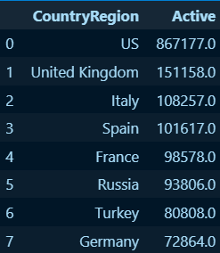
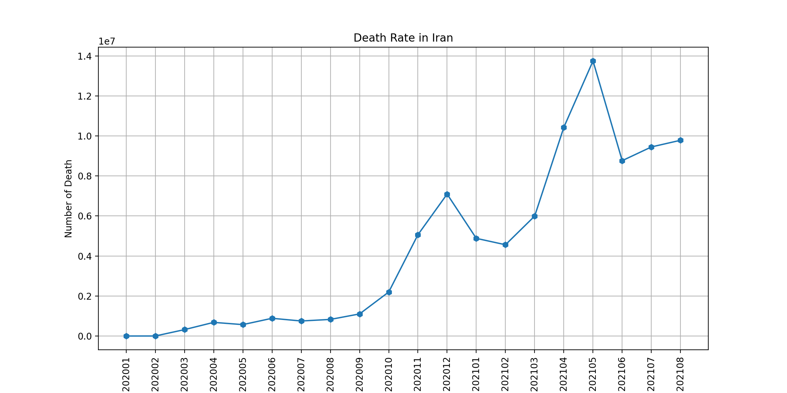
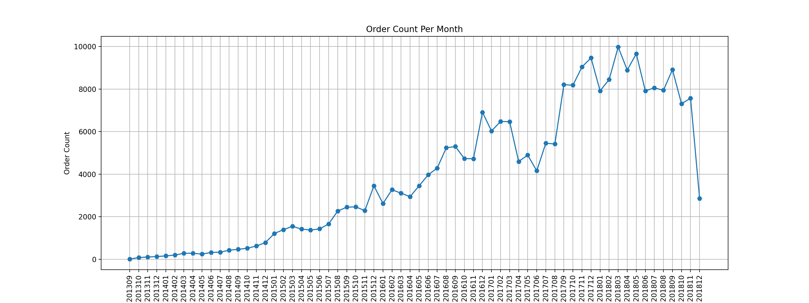
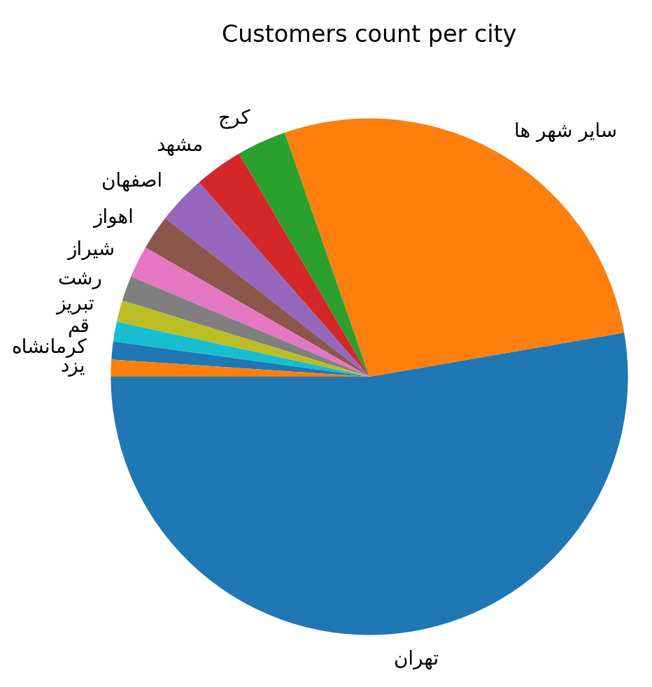

# COVID 19.csv
* A. Print the names of the 8 countries with highest corona patients in the fourth month of 2020.

* B. Plot the death rate in Iran on different days.

# digikala.csv
* A. Orders count per month (Plot).

* B. Customers count per city (Pie Plot).

