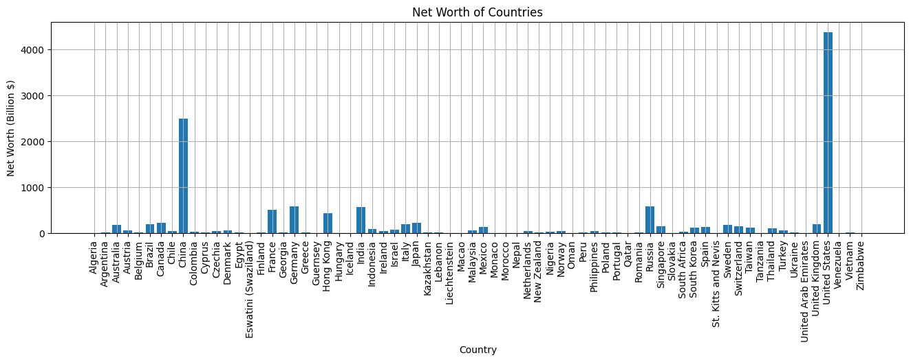
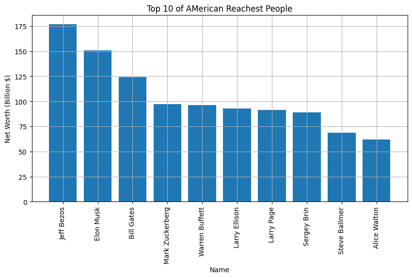
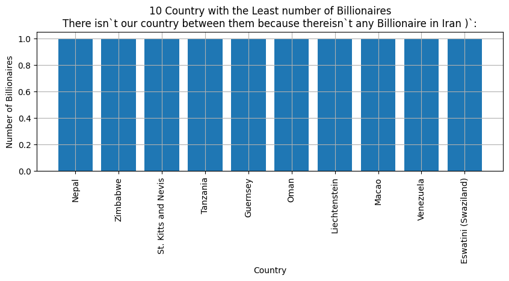
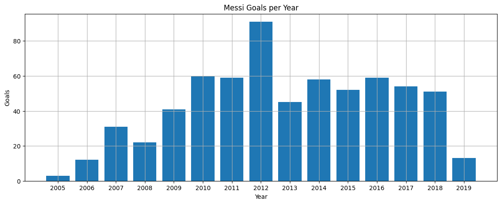
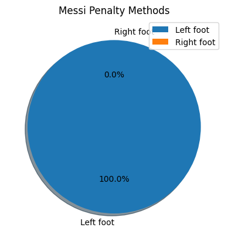
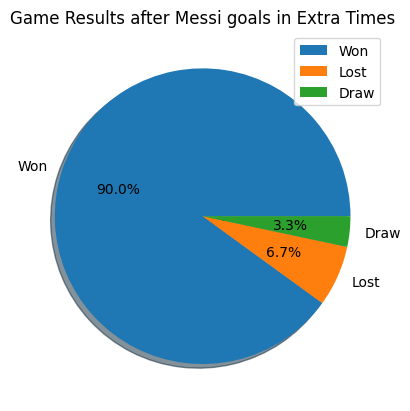
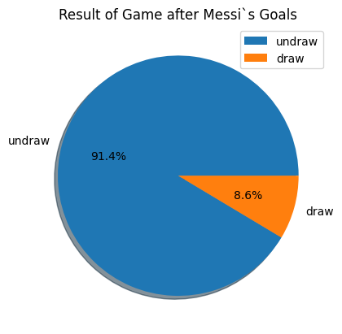

# 1. Billionaires

---
* A. میانگین و واریانس سن ثروتمند ترین افراد جهان را بدست آورید
### Mean :  63.1136023916293  
### Variance :  180.7721364011008
* B. مجموع ثروت هر کشور را بدست آورید و روی نمودار نمایش دهید

* C. ده فرد اول ثروتمند آمریکایی را به همراه ثروت آن ها بر روی نمودار نمایش دهید

D. ده کشوری که کمترین تعداد ثروتمند در جهان دارند را به همراه تعداد ثروتمندان آن ها بر روی نمودار نمایش دهید. چرا نام کشور ما در این لیست دیده نمی شود؟

# Messi

* A. ستون تاریخ را پیش پردازش کنید و مقدار سال را بدست آورید. سپس تعداد گل های مسی در هر سال را بر روی نمودار نمایش دهید

* B. مسی اکثر پنالتی ها را با پای چپ زده است یا با پای راست؟ بر روی نمودار نمایش دهید

* C. چند درصد بازی هایی که در آن ها مسی در وقت اضافه گل زده است، به پیروزی ختم شده اند؟ بر روی نمودار نمایش دهید

* تمرین ستاره دار ⭐️
D. چند درصد گل های مسی گل تساوی بوده است؟

