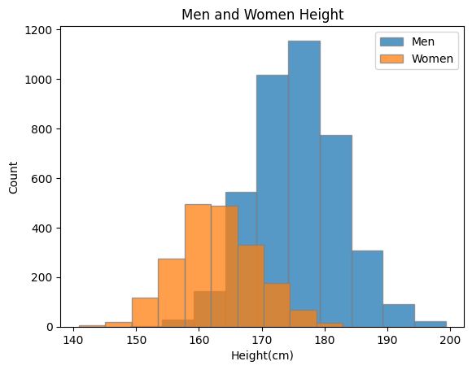
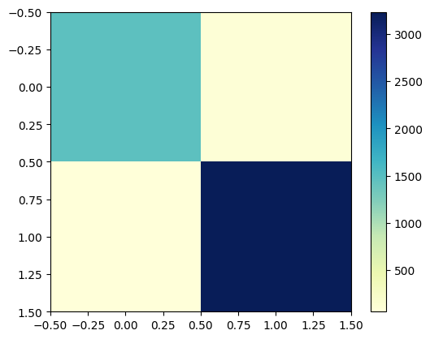
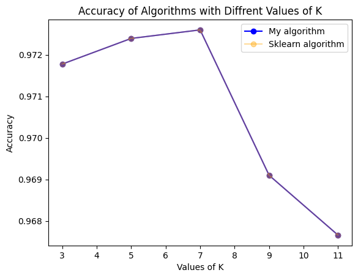
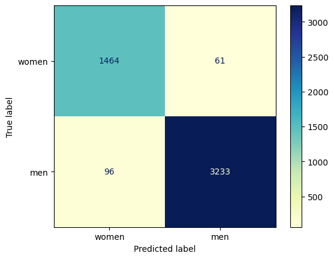

## Show heights for women and men on same plot.

### A. Why is the data of men higher than the data of women?

* Men have more consensus at the same heights | and of course the fact that we know more about men has a big impact.

### B. Why is the data of men more right than the data of women?

* Because the average height of men is higher than women

___
___
___

## Evaluate your KNN algorithm on the test dataset with different values of K and write accuracy results as a table

|               |       K=3     |       K=5     |       K=7     |       K=9     |      K=11     |
| ------------- | ------------- | ------------- | ------------- | ------------- | ------------- |
| Accuracy      |     0.9717758549649773 | 0.9723939019365472 | 0.9725999175937371 | 0.969097651421508 | 0.9676555418211784

___
___
___

## Calculate confusion matrix for test dataset.

___
___
___

## Evaluate the scikit-learn KNN algorithm on the test dataset. Make sure your accuracy is equal to scikit-learn's accuracy.

* Completely Same

___
___
___

## Calculate confusion matrix using scikit-learn:

