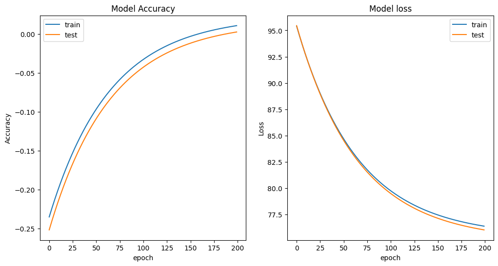

## 1. Surgical Deepnet
* **1. Fit an object oriented perceptron algorithm on the surgical dataset for classification**

||Loss|Accuracy|
|-|-|-|
||0.1832312925931837 | 18.160915613255895 |

* **2. Plot accuracy in each epoch for train and test data**

* **3. Plot loss in each epoch for train and test data**

* **4. Calculate confusion matrix**

* **5. Repeat the above steps with 5 different activation functions**

||Activation Function|Accuracy|Loss|
|-|-|-|-|
||sigmoid|18.194738640245987|0.17943495748797134|
||relu|18.098735907072086|0.18213520418590473|
||tanh|18.11308507003758|0.20348117270402355|
||linear|18.097027673385718|0.25346282231137649|
||softmax|18.137341988384012|0.19362657239823875|

## 2. Weather Prediction
* Weather During Year

* Accuracy and Loss of Trained Linear Model 

* Weights and Bias of model saved as ***.npy*** file

||||FilesLocation|
|-|-|-|-|
||Weights|:|[Outputs\Weather_Prediction_Weights.npy](Outputs\Weather_Prediction_Weights.npy)|
||Bias|:|[Outputs\Weather_Prediction_Bias.npy](Outputs\Weather_Prediction_Bias.npy)|