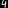

## 1. Precision & Recall

* I implemented Precision and Recall functions from scratch and te results were definitely like Scikit Learn

|   | Precision | Recall |  |
| -- | -- | -- | -- |
| My Funcs | 0.4669887278582931 | 0.4309063893016345 |  |
| Scikit Learn | 0.4669887278582931 | 0.4309063893016345 |  |

## 2. MLP

* I implemented a simple neural network (**MLP**) as a class and checked its fit, evaluate and predict methods

___

* **Plot loss and accuracy using MatPlotLib**


* **Report your loss and accuracy on train and test data in readme.md**

|   | loss | Accuracy | |
| -- | -- | -- | -- |
| Train | 0.0633895707075286 | 0.9839944328462074 |
| Test | 0.14593637618508581 | 0.9839944328462074

* **Check your predict method with images of the numbers you wrote in your own handwriting**

|| Test Image | Result |
| -- | -- | -- |
||  | 4 |

___
* I also implemented **OneHot Encoder & Decoder** :

```
My encoded data : [[1. 0. 0.]
 [0. 1. 0.]
 [0. 0. 1.]
 [1. 0. 0.]
 [0. 0. 1.]]
Scikit Learn encoded data :  [[1. 0. 0.]
 [0. 1. 0.]
 [0. 0. 1.]
 [1. 0. 0.]
 [0. 0. 1.]]
Decoded My Encoded Data :  [0, 1, 2, 0, 2]
Decoded Scikit Learn Encoded Data :  [0, 1, 2, 0, 2]
```

