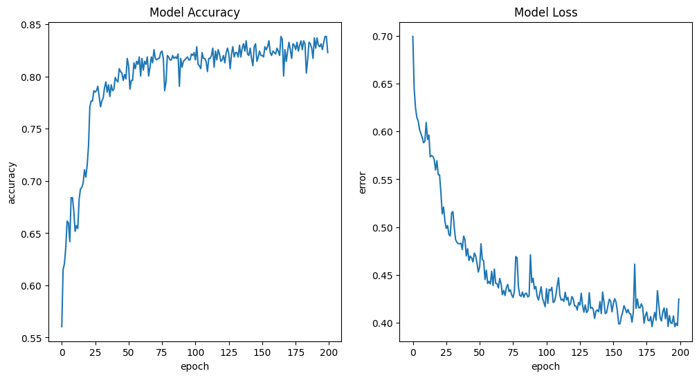

# Titanic
* **Implement a Multi Layer Perceptron Neural Network for this classification task and fit your model on train dataset**

* **Evaluate your model on test dataset**

||Loss|Accuracy|
|---|---|---|
||0.4212866723537445 | 0.8212290406227112
|||

* **Calculate precision and recall**

||Precision|Recall|
|---|---|---|
||0.8305084745762712 | 0.6901408450704225
|||

* **Predict your model on Jack and Rose data**

* Jack `→` Dead(0)

* Rose `→` Alive(1)

* **Fill the following table**

|Algorithm|Accuracy|
|---|---|
|KNN| 0.8212290502793296 |
|Perceptron| 0.8212290406227112 |
|MLP| 0.8212290406227112 |