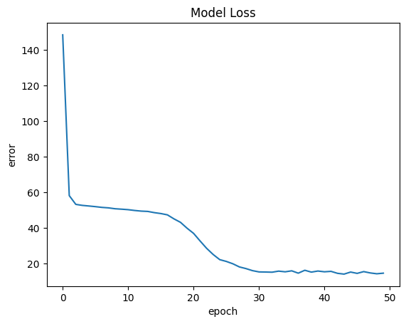
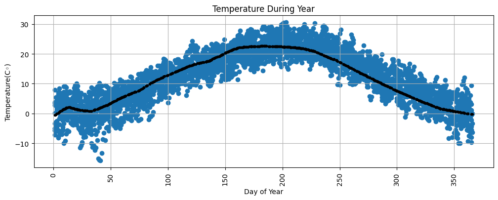
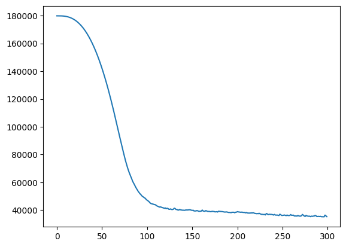
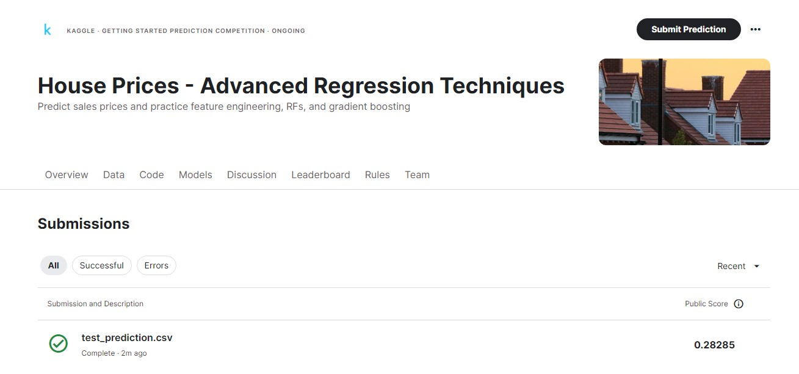

## 2. Weather (predictor)
* **Re-Implement Assignment 6.7 Question 2 (Weather Prediction) using neural network**

```
loss : 14.601460456848145
```
* **Plot regression line on data**

* **Compare results**

||MLP|Perceptron|
|---|---|---|
|Loss|14.601460456848145|77.42854848238612|
## 3. House Price (predictor)
* **Implement a neural network model for predict house sales prices**



* **Evaluate your trained model on validation data (You should achieve an loss < $50000)**
```
Loss : 35116.68359375 $ (< $5000)
```

* **Predict yourself house price with your trained model**
```
my_house = np.array([[2004, 1850, 0, 2, 750, 0]])

predict : 264422.53 $
```

* **Save your trained model as a `*.h5` extension file**

    Saved File : [my_model.h5](C:\Users\USER\Documents\MachineLearning\50.HousePrice\Outputs\my_model.h5)


* **Submit your model to  <span style="color: blue;">kaggle</span> competitions**
